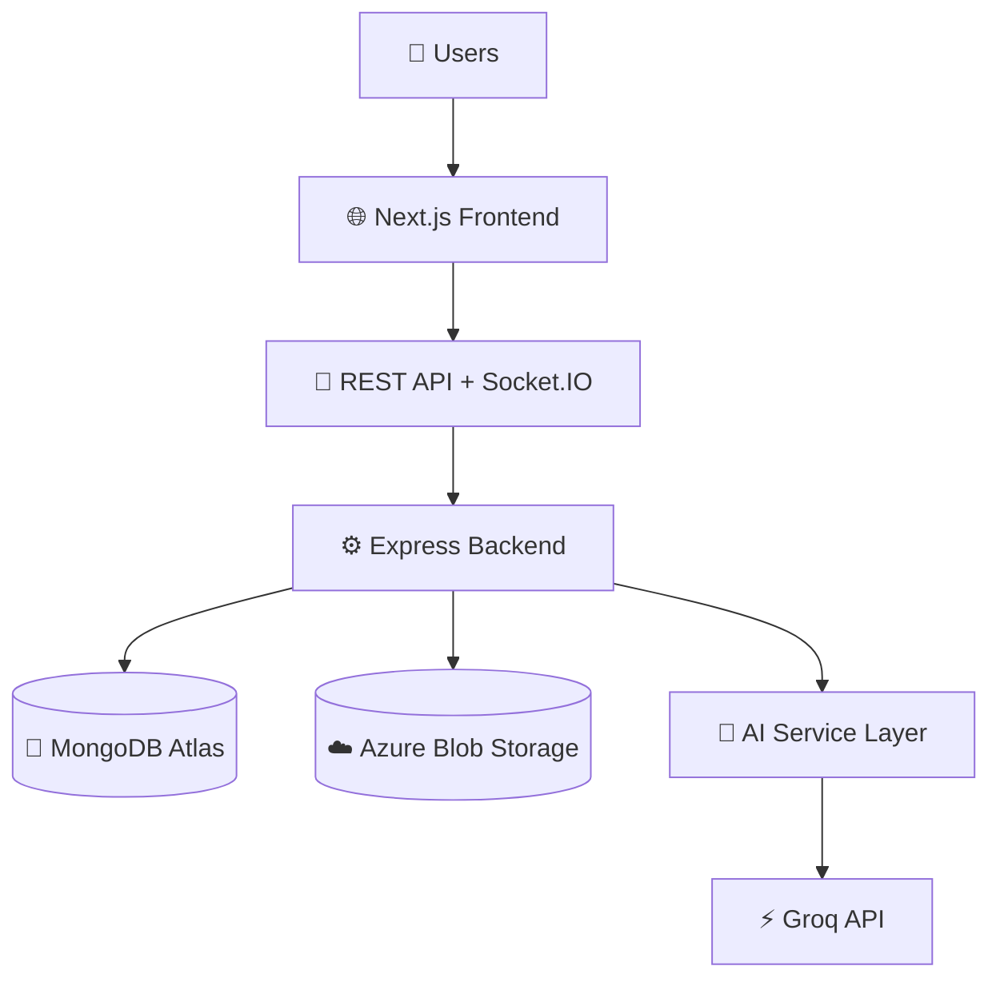

<div align="center">


<br/>

<p>
  
  
  
  
  
  
</p>

<p>
  <a href="#-overview">Overview</a> •
  <a href="#-core-highlights">Highlights</a> •
  <a href="#-architecture">Architecture</a> •
  <a href="#-tech-stack">Tech Stack</a> •
  <a href="#-quick-start">Quick Start</a> •
  <a href="#-roadmap">Roadmap</a>
</p>

</div>

---

## 🌌 Overview

> **Sentio** transforms passive sessions into **interactive, intelligent experiences**.

Run live polls, quizzes, and Q&A in real time while AI handles the heavy lifting:
- generating questions,
- analyzing engagement patterns,
- summarizing sessions,
- and producing actionable reports.

Designed for **educators, trainers, speakers, and event hosts**.

---

## ✨ Core Highlights

<table>
<tr>
<td width="50%">

### 🎯 Real-Time Engagement
- Live polls & quizzes  
- Instant Q&A updates  
- Audience count tracking  
- Live visualization updates  

</td>
<td width="50%">

### 🧠 AI Intelligence
- AI-generated questions  
- AI session summaries  
- Topic & keyword extraction  
- Engagement recommendations  

</td>
</tr>
<tr>
<td width="50%">

### 📊 Analytics Engine
- Participation rate  
- Accuracy trends  
- Response-time insights  
- Engagement score  

</td>
<td width="50%">

### 📄 Smart Reporting
- Auto-generated reports  
- AI-driven insights  
- Chart-rich summaries  
- Export to **PDF/CSV**  

</td>
</tr>
</table>

---

## 🧩 Problem vs Solution

| ⚠️ Traditional Tools | ✅ Sentio |
|---|---|
| Manual question creation | AI-generated polls/quizzes/questions |
| Basic analytics only | Deep engagement analytics |
| No in-session intelligence | Real-time AI recommendations |
| Generic post-session reports | Insightful, actionable AI reports |

---

## 🏗️ Architecture



---

## 🛠️ Tech Stack

<div align="center">

| Layer | Stack |
|------|-------|
| **Frontend** | Next.js • React • TypeScript • Tailwind CSS • shadcn/ui • Framer Motion |
| **Backend** | Node.js • Express.js • Socket.IO |
| **Database** | MongoDB Atlas |
| **Cloud Storage** | Azure Blob Storage |
| **AI** | Groq API + Provider-abstracted AI Service Layer |
| **DevOps** | GitHub Actions • Vercel • Render |

</div>

---

## 🔐 Security & Auth

- JWT Access + Refresh Tokens  
- HTTP-only Cookies  
- bcrypt Password Hashing  
- Role-Based Access (**Admin / Presenter / Participant**)  
- Helmet, CORS, Rate Limiting, Input Validation, Audit Logs  

---

## 📈 Analytics You Can Actually Use

Sentio computes meaningful learning/engagement metrics:

- Participation Rate  
- Response Accuracy  
- Average Response Time  
- Engagement Score  
- Attendance Insights  
- Poll/Quiz Distribution Trends  

---

## ⚡ Quick Start

```bash
# Clone
git clone https://github.com/SonetShaji6/Sentio.git
cd Sentio

# Install dependencies
npm install

# Setup env
cp .env.example .env

# Run
npm run dev
```

---

## 🔧 Example Environment Variables

```env
NODE_ENV=development
PORT=5000
CLIENT_URL=http://localhost:3000

MONGODB_URI=your_mongodb_uri

JWT_ACCESS_SECRET=your_access_secret
JWT_REFRESH_SECRET=your_refresh_secret

GROQ_API_KEY=your_groq_api_key

AZURE_STORAGE_CONNECTION_STRING=your_azure_connection_string
AZURE_STORAGE_CONTAINER=sentio-assets
```

---

## 🚀 CI/CD & Deployment

- **Version Control**: GitHub  
- **Automation**: GitHub Actions (lint/test/build/deploy)  
- **Frontend**: Vercel  
- **Backend**: Render  
- **Monitoring**: `/health`, build logs, uptime checks, Atlas metrics  

---

## 🔮 Roadmap

- 📱 React Native mobile app  
- 🌍 Multi-language experience  
- 🎓 LMS integrations  
- 🎥 Zoom / Teams / Meet integration  
- 🗣️ Voice-based interaction  
- 🏢 Enterprise SSO + billing  
- 🧩 Multi-provider / self-hosted LLM support  

---

## 🤝 Contributing

PRs are welcome!  
If you’d like to improve Sentio, open an issue and submit a pull request.

---

## 📜 License

Add your license here (MIT / Apache-2.0 / etc.)

---

<div align="center">

### 💜 Built to make every session more interactive, data-driven, and unforgettable.


</div>
